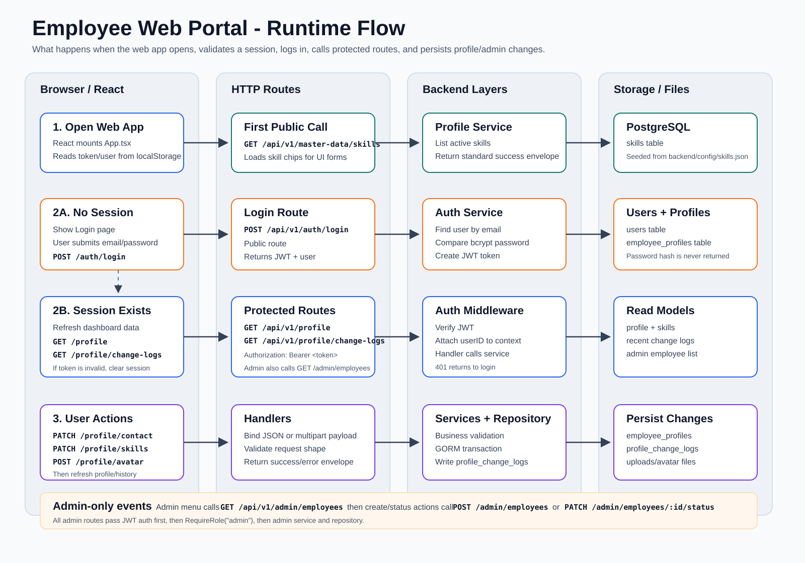

# Employee Web Portal

Employee Web Portal is a full stack assignment project for a Senior Golang Developer interview. It provides a simple but realistic employee self-service portal where users can sign in, view their profile, update contact details, upload an avatar, manage skills, and review profile change history. Admin users can also create employee accounts and activate or deactivate employees.

The project is intentionally structured to show practical backend engineering decisions without making the codebase unnecessarily complex: Gin for HTTP delivery, Clean Architecture style separation, GORM auto migration, PostgreSQL persistence, JWT authentication, centralized errors, structured logs, graceful shutdown, Swagger UI, and a React TypeScript frontend.

## Project Overview

The system has two applications:

- `backend`: Go API server using Gin, GORM, PostgreSQL, JWT, and `slog`.
- `frontend`: Vite React TypeScript app that calls the versioned API under `/api/v1`.

The main API contract is available from the running backend:

- Swagger UI: `http://localhost:8080/swagger`
- OpenAPI JSON: `http://localhost:8080/openapi.json`
- Health check: `http://localhost:8080/healthz`

## Feature List

- JWT login for demo and admin accounts
- Responsive React employee portal UI
- View current employee profile
- Read-only employee identity fields: first name and last name
- Update contact information separately: mobile phone, contact email, address
- Upload profile avatar with file validation
- Select employee skills from configurable JSON master data
- View searchable change history for recent profile updates
- Filter change history by contact, skills, avatar, or all logs
- Admin employee management
- Admin create employee
- Admin activate or deactivate employee accounts
- PostgreSQL database with GORM auto migration
- Seed demo users and skills without creating duplicates
- Centralized API success and error response format
- Structured request logging with request ID
- Graceful shutdown for HTTP server and database connection
- Swagger UI and OpenAPI contract for API exploration

## Architecture

The backend follows a lightweight Clean Architecture style. Gin exists only at the HTTP delivery layer. Business logic lives in services, and database access lives in repositories.



Primary runtime flow:

1. React mounts `App.tsx`, reads the saved token/user from `localStorage`, and always loads skill options through `GET /api/v1/master-data/skills`.
2. If there is no saved token, React shows the login page. Login submits `POST /api/v1/auth/login`, then stores the returned JWT and user.
3. If there is a saved token, or login has just succeeded, React refreshes dashboard data through `GET /api/v1/profile` and `GET /api/v1/profile/change-logs?days=7`.
4. Protected routes pass through JWT middleware. If the token is invalid or expired, the frontend clears the session and returns to the login page.
5. Profile actions call `PATCH /api/v1/profile/contact`, `PATCH /api/v1/profile/skills`, or `POST /api/v1/profile/avatar`, then refresh profile and history data.
6. Admin users also call `GET /api/v1/admin/employees`; create and status actions use `POST /api/v1/admin/employees` and `PATCH /api/v1/admin/employees/{id}/status`.
7. Handlers bind HTTP payloads, services apply business rules, repositories use GORM transactions, and responses return in a consistent success/error envelope.

## Folder Structure

```text
employee-web-portal/
  backend/
    cmd/api/                 # API entrypoint, server startup, graceful shutdown
    config/                  # JSON configuration such as skills.json
    docs/                    # OpenAPI contract and Swagger UI HTML
    internal/
      config/                # Environment/config loading
      database/              # PostgreSQL connection, auto migration, seed data
      domain/                # Entities and application errors
      handler/               # Gin routes and HTTP handlers
      middleware/            # Auth, role guard, request logging
      repository/            # GORM database access
      response/              # Standard API response helpers
      service/               # Business logic
    uploads/                 # Uploaded avatar files
  frontend/
    src/
      api/                   # API client and endpoint calls
      components/            # Shared UI components
      pages/                 # Login, profile, history, employees screens
      types/                 # TypeScript API/domain types
  docs/
    flow-overview.png        # Original architecture overview image
    runtime-flow.svg         # Step-by-step frontend/backend runtime flow
```

## Database Design

The database uses 5 main tables:

| Table | Purpose |
| --- | --- |
| `users` | Login identity: email, password hash, role, active status |
| `employee_profiles` | Profile details: name, avatar, phone, contact email, address |
| `skills` | Configurable skill master data loaded from JSON |
| `employee_profile_skills` | Many-to-many join table between profiles and skills |
| `profile_change_logs` | Audit log for contact, skills, and avatar changes |

Relationships:

- `users` 1:1 `employee_profiles`
- `employee_profiles` many-to-many `skills`
- `users` 1:N `profile_change_logs`
- `employee_profiles` 1:N `profile_change_logs`

GORM auto migration creates and updates the schema on startup. Seed logic uses idempotent operations so restarting the app does not duplicate demo users or skills.

## Skills Configuration

Skill options are loaded from JSON instead of being hardcoded in Go:

```text
backend/config/skills.json
```

Example:

```json
[
  { "code": "go", "name": "Go", "displayOrder": 1, "isActive": true },
  { "code": "react", "name": "React", "displayOrder": 2, "isActive": true }
]
```

This makes it easy to add, rename, hide, or reorder skill options without changing service or handler code.

## API Overview

All business API routes are versioned under `/api/v1`.

| Method | Endpoint | Description |
| --- | --- | --- |
| `POST` | `/api/v1/auth/login` | Login and receive JWT token |
| `GET` | `/api/v1/profile` | Get current user's profile |
| `PATCH` | `/api/v1/profile/contact` | Update mobile phone, contact email, and address |
| `PATCH` | `/api/v1/profile/skills` | Replace current user's selected skills |
| `POST` | `/api/v1/profile/avatar` | Upload current user's avatar |
| `GET` | `/api/v1/profile/change-logs?days=7` | Get recent profile change logs |
| `GET` | `/api/v1/master-data/skills` | Get active skill options |
| `POST` | `/api/v1/demo/profile/reset` | Reset demo profile data |
| `GET` | `/api/v1/admin/employees` | Admin: list employees |
| `POST` | `/api/v1/admin/employees` | Admin: create employee |
| `PATCH` | `/api/v1/admin/employees/{id}/status` | Admin: activate or deactivate employee |
| `GET` | `/healthz` | Health check |
| `GET` | `/openapi.json` | OpenAPI contract |
| `GET` | `/swagger` | Swagger UI |

Swagger UI is served from a small static HTML file and loads the OpenAPI spec from `/openapi.json`. The UI uses the Swagger UI CDN, so if the CDN is unavailable during a demo, open `/openapi.json` directly to inspect the contract.

## API Response Format

Success response:

```json
{
  "success": true,
  "data": {}
}
```

Error response:

```json
{
  "success": false,
  "error": {
    "code": "VALIDATION_ERROR",
    "message": "Invalid email format"
  },
  "requestId": "..."
}
```

The service layer returns domain errors such as validation, unauthorized, forbidden, not found, conflict, or internal errors. Handlers pass those errors to a shared response helper so HTTP status codes and JSON shape stay consistent.

## User Flows

### Login + JWT

1. User enters email and password in the React login page.
2. Frontend calls `POST /api/v1/auth/login`.
3. Backend verifies the password hash.
4. Backend returns a JWT token and basic user data.
5. Frontend stores the token and sends it in `Authorization: Bearer <token>` for protected API calls.

### Employee Profile Update

1. User edits mobile phone, contact email, or address.
2. Frontend calls `PATCH /api/v1/profile/contact`.
3. Service validates the payload and compares old values with new values.
4. Repository updates the profile in a transaction.
5. Changed fields are written to `profile_change_logs`.

### Avatar Upload

1. User selects an image beside the avatar preview.
2. Frontend sends multipart form data to `POST /api/v1/profile/avatar`.
3. Backend validates the file and stores it under `backend/uploads`.
4. Profile `avatar_url` is updated.
5. A change log entry records the avatar update.

### Skills Update From JSON Config

1. Backend reads `backend/config/skills.json` during startup seed.
2. Active skills are exposed through `GET /api/v1/master-data/skills`.
3. Frontend renders those skill options as selectable chips.
4. User saves selected skills through `PATCH /api/v1/profile/skills`.
5. Backend syncs the many-to-many relation and records history.

### Change History Logging

Every profile change writes an audit log with:

- user ID
- employee profile ID
- change type
- field name
- old value
- new value
- created timestamp

The history page calls `GET /api/v1/profile/change-logs?days=7` and displays logs in a searchable table.

### Admin Create Employee

1. Admin signs in with an admin account.
2. Frontend shows the Employees menu.
3. Admin fills employee login, name, role, contact, address, and skills.
4. Frontend calls `POST /api/v1/admin/employees`.
5. Backend creates the user, profile, skill relations, and password hash in a transaction.

### Graceful Shutdown

The API server is started through `net/http.Server`. When the process receives an interrupt signal:

1. Server stops accepting new requests.
2. Existing requests receive a shutdown timeout window.
3. PostgreSQL connection is closed.
4. The application exits cleanly.

## Run Locally

### 1. Start PostgreSQL

From the project root:

```powershell
docker compose up -d
```

### 2. Run Backend

```powershell
cd backend
Copy-Item .env.example .env
go mod tidy
go run ./cmd/api
```

Backend default URL:

```text
http://localhost:8080
```

Verify backend:

```powershell
Invoke-RestMethod http://localhost:8080/healthz
```

Open API docs:

```text
http://localhost:8080/swagger
```

### 3. Run Frontend

Open another PowerShell terminal:

```powershell
cd frontend
Copy-Item .env.example .env
npm.cmd install
npm.cmd run dev
```

Frontend default URL:

```text
http://localhost:5173
```

## Demo Accounts

Employee user:

```text
Email: demo@employee.dev
Password: password123
```

Admin user:

```text
Email: admin@employee.dev
Password: password123
```

## Testing

Backend:

```powershell
cd backend
go test ./...
go build ./...
```

Frontend:

```powershell
cd frontend
npm.cmd run build
```

Manual smoke test:

1. Login with `demo@employee.dev`.
2. View profile.
3. Update contact information.
4. Upload avatar.
5. Update skills.
6. Open Change History and confirm new logs appear.
7. Login with `admin@employee.dev`.
8. Create a new employee.
9. Activate or deactivate an employee.
10. Open `http://localhost:8080/swagger` and confirm API docs load.

## Troubleshooting

- If the frontend cannot login, check that the backend is running on `http://localhost:8080` and the frontend `.env` API URL points to it.
- If PostgreSQL connection fails, run `docker compose ps` and confirm the database container is healthy.
- If demo data looks messy after testing, login and use the demo reset action, or restart with seed data.
- If Swagger UI does not render because internet/CDN is blocked, open `http://localhost:8080/openapi.json` directly.
- If environment values are changed, restart the backend or frontend dev server so the new values are loaded.
